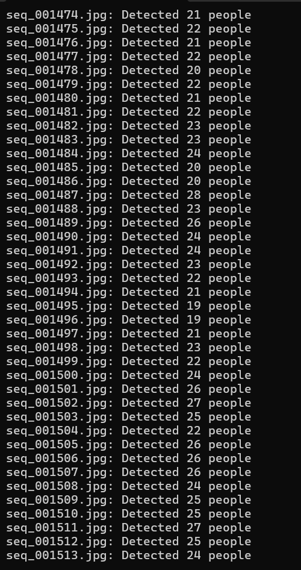
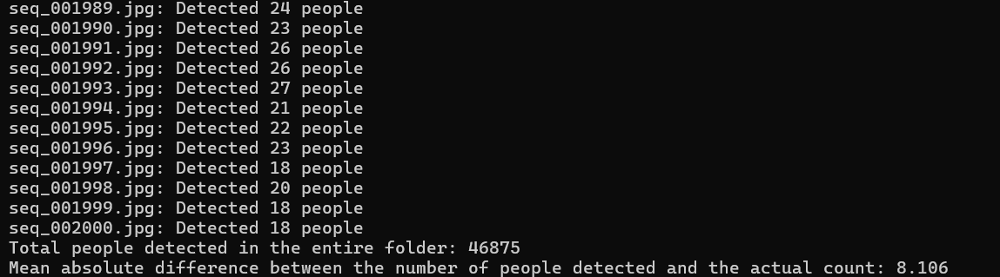

# Project 3: Crowd Counter

This is a short project made during a computer vision class I am taking in GWU.

To try out this program, first clone this repository. You are required to install `OpenCV` and `transformers` libraries in your Python environment.

```bash
$ pip install opencv-python
$ pip install transformers
```

Then, in the file directory, run:
```bash
$ python main.py <your-video-file-path> <confidence-threshold>
```
where `<your-video-file-path>` is the file path for the video and the `<confidence-threshold>` is the confidence of the system to detect a person; if not specify, 0.5 by default.

For example: 

```bash
$ python main.py ./videos/mall_surveillance.mp4 0.2
```

## Problem Domain and Brief Project Description

The goal is to develop a system that detects and counts the number of people in a surveillance video or a time-lapse of a mall. This kind of system is important for crowd monitoring and resource management in public settings such as malls, airports and events.

The output of this system is the total number of individuals detected in the entire video, as well as noting down the number of individual in each frame.

Example Data Input/Output

> Input: A video file (e.g., mall_surveillance.mp4).

> Output: The total count of people detected in the video (e.g., "Total people detected in the video: 345").

## Detailed Description of Approach

The system processes the video each frame by frame and detects people using a pre-trained object detection model, specifically, using Hugging Face's implementation of DETR (End-to-End Object Detection) model with ResNet-50 backbone; trained end-to-end on COCO 2017 object detection dataset.

First, I used DETR model for object detection, where it recognizes various classes of objects, including "person." For this project, the only focus is on identifying and counting the instances of the "person" class. The video input can come from any surveillance camera feed.

One challange I faced is when some bounding boxes that do not contain a person have a really low confidence score for "person", i.e. 0.2. but are still counted into the overall number of people.

I used a confidence score of 0.5 to ensure objects are not accidentally counted into the total, while being lenient to the model, allowing it to make slight mistakes. The confidence score can be adjusted by entering the `confidence-threshold` in the bash command if you wish to test a lower or higher score threshold.

One of the main issue with this approach is that the assumption that each frame has different people inside them. The distinction between a normal surveillance videos and a time-lapse are even crucial here; where time-lapse are essentially taking snapshots of a normal video at intervals and piecing them together.

With normal videos, we can process video frames at intervals (e.g., every 30th frame) to reduce computational load, since each frame have a very slight change between each other. However, with time-lapse videos, we need to process and track each frame instead. You can adjust which type of video by changing the boolean variable: `is_time_lapse`.

## Result

This approach works well for basic people counting in relatively simple scenarios, but it is prone to double-counting the same people if they appear in multiple frames. The system detects people frame by frame and simply sums up the detections.

### Testing with the Dataset

To test the system using the `mall_gt.mat` dataset provided by [The Mall dataset](https://personal.ie.cuhk.edu.hk/~ccloy/downloads_mall_dataset.html):

1) Load and Process Ground Truth Data:

> Use scipy.io.loadmat to load the .mat file.

> Extract the frame array, which contains annotated coordinates of people in each frame, and the count array, which contains the true count of people per frame.

2) Compare with Model Output:

> Run the detection and counting model on the video or image folder and retrieve the detected counts for each frame.

> Compare the model’s detected count with the ground truth in `count` to evaluate accuracy.

<p align="center">
    
    <br>
    Original image
    <br>
    
</p>

To evaluate the correctness of the system, I used the mean absolute difference among all of the frames

<p align="center">
    
    <br>
    Final result
</p>

The mean absoulte difference is 8.106, which is quite high. This may result from having a higher confidence threshold that filters out misclassified objects but also outliers. Additionally, the Hugging Face's implementation of DETR is trained on COCO (Common Object in Context) dataset, which is more general-purpose and limit the performance of the system.

## Tools and Resources

The project was developed in Python, utilizing mutliple libraries and dataset:

1) [OpenCV library](https://docs.opencv.org/4.x/d8/dfe/classcv_1_1VideoCapture.html)

    Used for video processing and frame extraction

2) [Hugging Face Transformers](https://huggingface.co/facebook/detr-resnet-50)

    Utilising facebook/detr-resnet-50 model for object detection

3) [Pillow](https://pillow.readthedocs.io/en/stable/index.html)

    Used for image manipulation

4) [The mall dataset](https://personal.ie.cuhk.edu.hk/~ccloy/downloads_mall_dataset.html)

    Used for testing the results, remains as a zip file to reduce repository size
